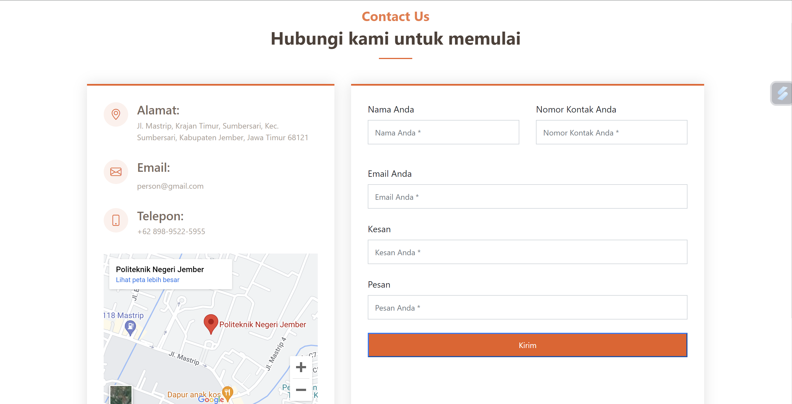

# Contact Us With WhatsApp

## Ikhtisar
Repositori ini berisi kode sumber untuk formulir "Kontak Kami" untuk sebuah situs web. Formulir ini memungkinkan pengguna untuk memberikan umpan balik, pertanyaan, atau pesan yang akan dikirim melalui WhatsApp.

## Fitur-fitur
- **Formulir Input Pengguna**: Pengguna dapat memasukkan nama, email, pesan, dan rincian tambahan.
- **Integrasi WhatsApp**: Pesan yang dikirim melalui formulir akan langsung dikirimkan ke kontak WhatsApp.

## Teknologi yang Digunakan
- HTML
- CSS
- JavaScript
- Bootstrap

## Setup
1. Klona repositori ke komputer lokal Anda.
2. Pastikan Anda memiliki akun WhatsApp dan nomor telepon yang terkait dengannya.
3. Sesuaikan kode JavaScript untuk menyertakan rincian kontak WhatsApp Anda.
4. Terapkan file HTML, CSS, dan JavaScript ke server web Anda.

## Penggunaan
1. Buka halaman web tempat formulir di-host.
2. Isi formulir dengan nama Anda, email, pesan, dan rincian lain yang diperlukan.
3. Kirim formulir.
4. Pesan Anda akan diteruskan ke kontak WhatsApp yang ditentukan.

## Preview

